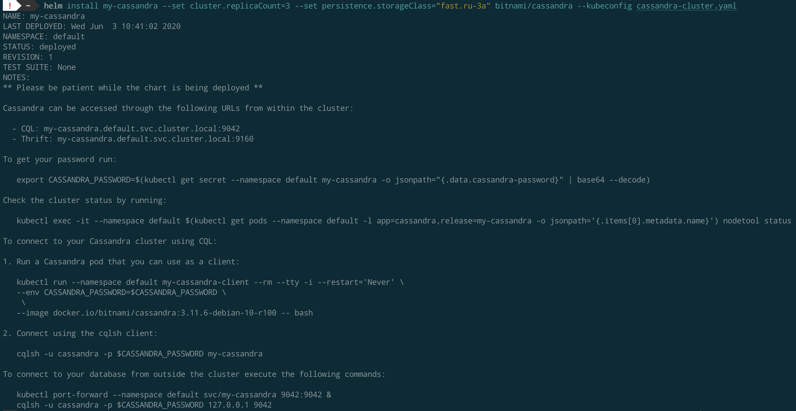

## Running Cassandra cluster in Kubernetes

#### Environment

* Kubernetes cluster (k8s version 1.16.9) created in [Selectel Managed Kubernetes Service](https://selectel.ru/en/services/cloud/kubernetes/).
* Single nodegroup with 3 worker nodes (1 vCPU, 3 Gi RAM)

#### Installation

For the sake of simplicity I used already prepared Helm chart to install Cassandra cluster:
https://github.com/bitnami/charts/tree/master/bitnami/cassandra/#installing-the-chart



Check pods and PVC's: 


Check Cassandra cluster status:


#### Stress testing using `cassandra-stress` util

Export `cassandra` user password into env variable: 
```bash
export CASSANDRA_PASSWORD=$(kubectl get secret \
                                    --kubeconfig cassandra-cluster.yaml \
                                    --namespace default my-cassandra \
                                    -o jsonpath="{.data.cassandra-password}" | base64 --decode)
```

Run `write` test:
```bash
kubectl exec -it \
             --kubeconfig cassandra-cluster.yaml \
             --namespace default \
             $(kubectl get pods \
                           --kubeconfig cassandra-cluster.yaml \
                           --namespace default -l app=cassandra,release=my-cassandra \
                           -o jsonpath='{.items[0].metadata.name}')\
              -- /opt/bitnami/cassandra/tools/bin/cassandra-stress write n=1000000 -mode thrift user=cassandra password=$CASSANDRA_PASSWORD
```

Results:


Full output: [stress_write.txt](https://github.com/dstdfx/otus-dbmgmt/blob/master/part43/cassandra-stress-output/stress_write.txt)

Run `read` test:
```bash
kubectl exec -it \
             --kubeconfig cassandra-cluster.yaml \
             --namespace default \
             $(kubectl get pods \
                           --kubeconfig cassandra-cluster.yaml \
                           --namespace default -l app=cassandra,release=my-cassandra \
                           -o jsonpath='{.items[0].metadata.name}')\
              -- /opt/bitnami/cassandra/tools/bin/cassandra-stress read n=1000000 -mode thrift user=cassandra password=$CASSANDRA_PASSWORD
```

Results:


Full output: [stress_read.txt](https://github.com/dstdfx/otus-dbmgmt/blob/master/part43/cassandra-stress-output/stress_read.txt)

